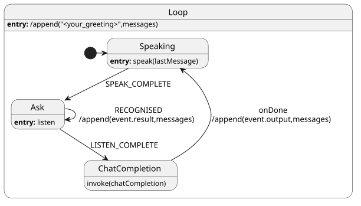

#+TITLE: LLMs  and RAG

In this lab you will explore how LLMs in combination with Retrieval-Augumented Generation (RAG) can be used in XState and SpeechState. You will be using Chroma as infrustructure for RAG.

Relevant documentation:
- XState docs: https://stately.ai/docs/xstate
- SpeechState docs (under construction): https://speechstate.maraev.me/
- Chroma docs: https://docs.trychroma.com/docs/overview/introduction
- OpenAI chat completions API:
  - [[https://developers.openai.com/api/reference/typescript/resources/chat/subresources/completions/methods/create][OpenAI reference]] 
  - [[https://console.groq.com/docs/openai][Groq's OpenAI-compatible API]]
  - [[https://docs.ollama.com/api/openai-compatibility][ollama's OpenAI-compatible API]]

* Part 1: Chit-chat with SpeechState

In this part you will create a voice-enabled chatbot. 

1. Fork and clone this repository.
2. In your code implement an information state update pattern which will help you maintain the history of your dialogue. This will make the chat less repetitive.
   - Intoduce ~messages: Message[]~ into your context, where ~Message~ is:
     #+begin_src typescript
     type Message = {
       role: "assistant" | "user" | "system";
       content: string;
     }
     #+end_src
   - You will be adding every recognised utterance (user) and every result from the LLM (assistant) as a element to the ~messages~ array. 
   - You will be using  ~messages~ as a part of your chat completions API calls.
3. You can add a starting ~system~ message that will act as initial
   prompt to the LLM, for instance, instructing it to provide very
   brief chat-like responses.
4. Modify the ~fetch~ actor from exercise to provide chat completions on
   the basis of the ~messages~.
5. Invoke this actor in order to implement an infinite completion
   loop. You can refer to the diagram below (some details omitted) or
   modify it according to your own perspective.

  #+begin_src plantuml :results output replace file :file img/completion.svg :exports results :tangle statechart.plantuml
  @startuml
  state Loop {
    [*] -> Speaking
    ChatCompletion: invoke(chatCompletion)
    ChatCompletion -> Speaking: onDone\n/append(event.output,messages)
    Speaking: **entry:** speak(lastMessage)
    Speaking --> Ask: SPEAK_COMPLETE
    Ask: **entry:** listen
    Ask --> Ask: RECOGNISED\n/append(event.result,messages)
    Ask --> ChatCompletion: LISTEN_COMPLETE
  }
  Loop: **entry:** /append("<your_greeting>",messages)
  #+end_src

  #+RESULTS:
  
  
    #+begin_quote
   *** ~/append(...)~ is a shorthand for ~assign~ action which appends a new message to the list of messages.
    #+end_quote

After this is done you should be able to have a chat with your LLM!

* Part 2. RAG or chat about the documents

** Starting point

1. Ask your dialogue system a question about something only relevant for GU students (e.g., "what's Feelgood phone number") and you'll run into trouble.
2. We scraped the "Service and support" portal for you. You can find
   the scraper written in Python in a [[lab1/]] folder. It work like this:
   - It takes pages URLs from the ~urls.txt~ file.
   - It parses the page title and scrapes the content from HTML elements that look like this (they roughly represent the sections of the document):
     #+begin_src html
     

     

     #+end_src
   - It exports every page into a text file where the sections are
     divided by ~\n\n\n~ character sequence.
3. The resulting documents are in the [[lab1/data]] folder.
4. Feel free to modify this code and adjust it to your needs.
    
** Working with ChromaDB

In ~./chroma~  folder you will find our implementation of a command-line interface as well as the server which you can run locally.

*** Running the server
1. Go to the ~/chroma/~ folder.
2. Install the dependencies:
  #+begin_src sh
  npm i
  #+end_src
3. To run the server, run:
   #+begin_src sh
   npx chroma run --path ./db  
   #+end_src

The data will be stored locally, in the ~/chroma/db/~ folder.

*** Chroma Command-line Client
We implemented a TypeScript command client for Chroma. To learn how
you can use it, follow the documentation:
#+begin_src sh
  npx tsx src/main.ts --help
#+end_src
or, for a specific command:
#+begin_src sh
  npx tsx src/main.ts addData --help
#+end_src

*** Calling Chroma from SpeechState

This you will need to implement yourself.

** The Task
Your task is two-fold: 1) assemble RAG database, 2) use this
database to implement RAG in your speechstate application.

*** 1. Assemble RAG database
1. Create a collection where you will store your data. You can use an
   arbitrary name.
2. Add data to your collection. It is suggested that you implement a
   command-line command that will add data from a given folder all at
   once. Consider adding metadata to your documents which will make
   search faster and easier.
   - Documentation: https://docs.trychroma.com/docs/collections/add-data
3. Test if you can query 
