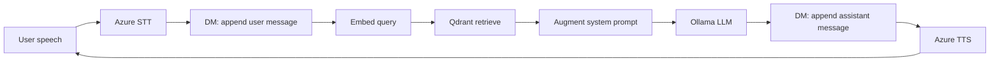
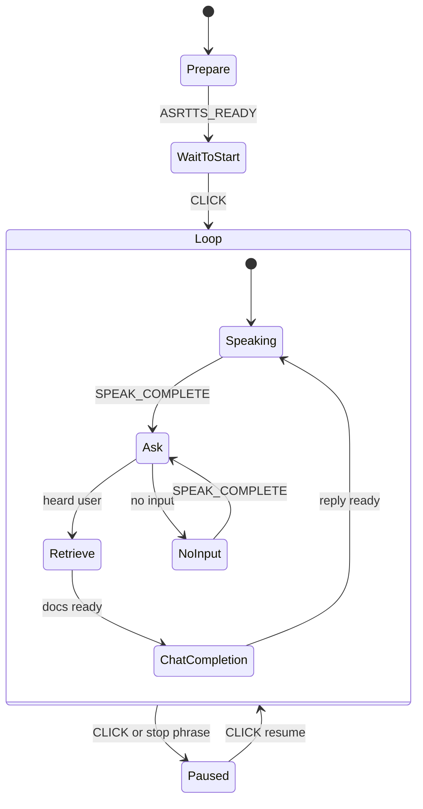

# Project Overview: RAG Dialogue Pipeline and Code Modules

**Note:** This document is for understanding the repo structure and pipeline.  
It is **not** the required Lab VG-RAG report. See `vg-rag-report.en.md` / `vg-rag-report.zh.md` for submission.

**Course:** Dialogue Systems 2  
**Focus:** End-to-end pipeline, code modules, and the role of the state machine

---

## 1. What this system does

This lab builds a **voice assistant** that can:

1. **Hear** the user (Azure Speech STT)
2. **Find** relevant GU student-support text (Qdrant RAG)
3. **Answer** with a local LLM (Ollama)
4. **Speak** the answer (Azure Speech TTS)

It is not only a chatbot: speech, retrieval, and generation are connected by one **dialogue manager (DM)** state machine.

---

## 2. Pipeline overview



**In one sentence:**  
STT → save history → retrieve docs → put docs into the prompt → LLM → TTS → listen again.

| Stage | Role | Main code |
|------|------|-----------|
| STT / TTS | Speech in/out | `speechstate` via `starter/src/dm.ts` |
| Dialogue history | `messages[]` context | `starter/src/types.ts`, `dm.ts` |
| Retrieval | Similar chunks from DB | `retrieve` actor in `dm.ts` + Qdrant |
| Augmentation | Docs into system prompt | `chatCompletion` in `dm.ts` |
| Generation | Short answer text | Ollama (`llama3.2`) |
| Offline indexing | Chunk + embed + upsert | `rag/src/main.ts` |

---

## 3. How modules relate

### 3.1 Offline (build the knowledge base)

```text
labs/lab1/data/*.txt
        │
        ▼
rag/src/main.ts  (addFolder / addData)
        │  chunk → qwen3-embedding → upsert
        ▼
Qdrant collection  gu_support_all
   (stored under rag/qdrant_data/)
```

- **`rag/src/main.ts`**: CLI to create collections, import a folder, and test queries.
- **Docker Qdrant**: vector database on `localhost:6333`.
- **Ollama `qwen3-embedding`**: turns text into 384-dim vectors (same size as the collection).

This part runs **before** the voice app. The web UI only **reads** the collection.

### 3.2 Online (one user turn)

```text
starter/src/dm.ts  (DM state machine)
   ├── SpeechState     → LISTEN / SPEAK
   ├── retrieve actor  → Qdrant
   └── chatCompletion  → Ollama chat
```

- **`types.ts`**: defines `Message` and `DMContext` (`messages`, `ragContext`, …).
- **`credentials.ts`**: Azure key/region (gitignored).
- **`main.ts` (starter)**: only mounts the page button; logic lives in `dm.ts`.

**Important:** chat history (`messages`) and RAG (`ragContext`) are different:

- `messages` = full dialogue memory for the LLM  
- `ragContext` = docs for **this turn**, injected into the system prompt, not kept as forever chat turns

---

## 4. Role of the state machine

Without a state machine, speech events, retrieval, and LLM calls would race or nest in messy callbacks. **XState** makes the turn order explicit.

### 4.1 Why it matters

| Need | State machine helps by… |
|------|-------------------------|
| Wait for TTS to finish before listening | `Speaking` → `SPEAK_COMPLETE` → `Ask` |
| Wait for ASR before RAG | `Ask` → `LISTEN_COMPLETE` → `Retrieve` |
| Wait for RAG before LLM | `Retrieve` → `onDone` → `ChatCompletion` |
| Handle silence | `NoInput` speaks a hint, then `Ask` again |
| Stop the endless loop | `Paused` after button click or “stop” / “goodbye” |

So the state machine is the **conductor**: Azure, Qdrant, and Ollama are instruments; the DM decides **when** each plays.

### 4.2 Main dialogue loop



### 4.3 Reflection

- The pipeline is easy to explain because each step is a **named state**.
- RAG fits naturally as **`Retrieve` between Ask and ChatCompletion** (classic R → A → G).
- A weakness: retrieval uses mainly the **latest utterance**. Follow-ups like “What about the phone number?” may need a richer query (e.g. last user + last topic). That would be a small change inside `retrieve`’s `input`, without redesigning the whole machine.

---

## 5. Short proof-of-concept notes

- One-shot GU question (“Feelgood phone number”) worked: retrieve returned the right chunk, answer included the real number.
- Multi-turn chitchat + later GU question still worked: history stays in `messages`; RAG still runs on the new question.
- Silence triggers VG-1 `NoInput` instead of a silent re-listen loop.
- Pause/resume avoids an infinite listen loop during testing.

---

## 6. Conclusion

The lab pipeline is:

**SpeechState (I/O) + Qdrant (knowledge) + Ollama (reasoning), orchestrated by an XState DM.**

The state machine’s job is not to “know GU facts”; it is to **order events and side effects** so RAG and chat stay reliable under voice timing. Keeping indexing (`rag/`) separate from dialogue (`starter/`) also keeps the project easy to test and submit.
