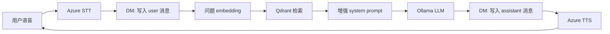
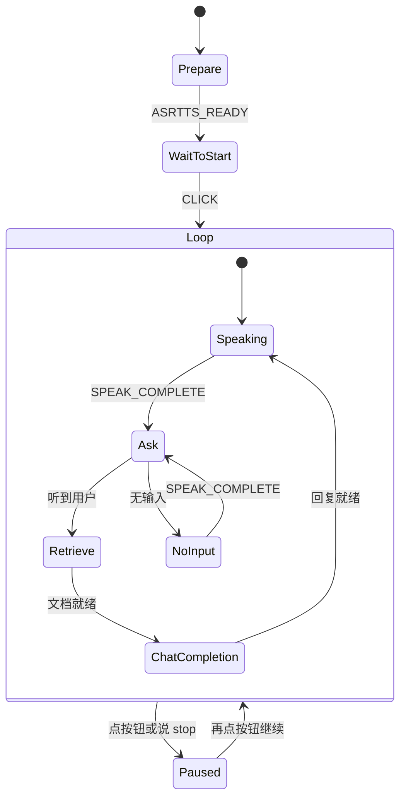

# 项目理解笔记：RAG 对话流水线与代码模块

**说明：** 本文档用于理解仓库结构与流水线，**不是** Lab 要求提交的 VG-RAG 报告。  
正式 VG 报告见 `vg-rag-report.zh.md` / `vg-rag-report.en.md`。

**课程：** Dialogue Systems 2  
**重点：** 端到端流程、代码模块关系、状态机的作用

---

## 1. 系统在做什么

本实验做一个**语音助手**，能够：

1. **听**用户说话（Azure Speech STT）
2. **查**与 GU 学生支持相关的文档（Qdrant RAG）
3. **用**本地 LLM 生成回答（Ollama）
4. **说**出答案（Azure Speech TTS）

它不只是文字聊天：语音、检索、生成由同一个**对话管理（DM）状态机**串起来。

---

## 2. 流水线总览



**一句话：**  
听写 → 记历史 → 检索文档 → 文档塞进提示 → LLM → 朗读 → 再听。

| 阶段 | 作用 | 主要代码 |
|------|------|----------|
| STT / TTS | 语音进/出 | `speechstate`（在 `starter/src/dm.ts` 里调用） |
| 对话历史 | `messages[]` | `starter/src/types.ts`、`dm.ts` |
| 检索 | 从库中取相似片段 | `dm.ts` 的 `retrieve` + Qdrant |
| 增强 | 文档写入 system | `dm.ts` 的 `chatCompletion` |
| 生成 | 简短回答 | Ollama（`llama3.2`） |
| 离线建库 | 切块、向量、入库 | `rag/src/main.ts` |

---

## 3. 各模块如何配合

### 3.1 离线：建知识库

```text
labs/lab1/data/*.txt
        │
        ▼
rag/src/main.ts （addFolder / addData）
        │  切块 → qwen3-embedding → upsert
        ▼
Qdrant 集合 gu_support_all
   （数据在 rag/qdrant_data/）
```

- **`rag/src/main.ts`**：命令行建库、整夹导入、测试查询。
- **Docker Qdrant**：本机 `6333` 端口的向量库。
- **Ollama `qwen3-embedding`**：文本 → 384 维向量（与 collection 维度一致）。

这部分在**启动语音应用之前**完成。网页端只**查询**已有集合。

### 3.2 在线：用户说一轮

```text
starter/src/dm.ts  （DM 状态机）
   ├── SpeechState     → LISTEN / SPEAK
   ├── retrieve actor  → Qdrant
   └── chatCompletion  → Ollama 聊天
```

- **`types.ts`**：定义 `Message`、`DMContext`（含 `messages`、`ragContext` 等）。
- **`credentials.ts`**：Azure 密钥与区域（已 gitignore）。
- **`starter/src/main.ts`**：只挂按钮；业务逻辑在 `dm.ts`。

**注意：** 对话历史和 RAG 不是一回事：

- `messages` = 给 LLM 的完整对话记忆  
- `ragContext` = **本轮**检索到的文档，写进 system prompt，不是永久当成聊天轮次保存

---

## 4. 状态机在里面的作用

如果没有状态机，语音事件、检索、LLM 容易在回调里打架。**XState** 把「这一轮先做什么、后做什么」写清楚。

### 4.1 为什么需要它

| 需求 | 状态机怎么保证 |
|------|----------------|
| TTS 说完再听 | `Speaking` → `SPEAK_COMPLETE` → `Ask` |
| ASR 完成再检索 | `Ask` → `LISTEN_COMPLETE` → `Retrieve` |
| 检索完成再生成 | `Retrieve` → `onDone` → `ChatCompletion` |
| 处理静音 | `NoInput` 先提示，再回 `Ask` |
| 结束无限听循环 | 按钮或口令进入 `Paused` |

所以状态机是**指挥**：Azure / Qdrant / Ollama 是乐器；DM 决定**谁何时演奏**。

### 4.2 主对话循环



### 4.3 一点反思

- 流程好讲，是因为每一步都是**有名字的状态**。
- RAG 很自然地放在 **`Ask` 和 `ChatCompletion` 之间的 `Retrieve`**（标准的 R → A → G）。
- 不足：检索主要用**最新一句**。若用户说 “What about the phone number?”（指代上文），可能不够。改进可以只改 `retrieve` 的 `input`（例如拼上最近话题），不必重做整台状态机。

---

## 5. 简单实测观察

- 单轮 GU 问题（Feelgood 电话）有效：检索命中正确片段，回答含真实号码。
- 先闲聊再问 GU 问题仍有效：`messages` 保留历史；RAG 仍按新问题检索。
- 静音会走 VG-1 的 `NoInput`，而不是无声死循环重听。
- 暂停/继续避免测试时一直 listen。

---

## 6. 结论

本实验流水线是：

**SpeechState（听说）+ Qdrant（知识）+ Ollama（推理），由 XState DM 编排。**

状态机的职责不是“记住 GU 事实”，而是**排好事件与副作用的顺序**，让语音时间线下的 RAG 对话可靠。建库（`rag/`）与对话（`starter/`）分开，也便于测试和提交作业。
